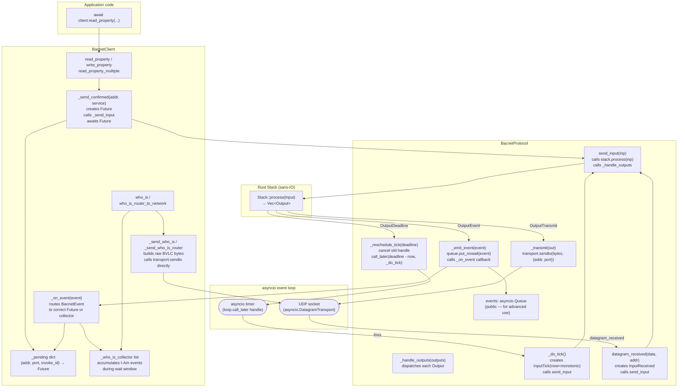
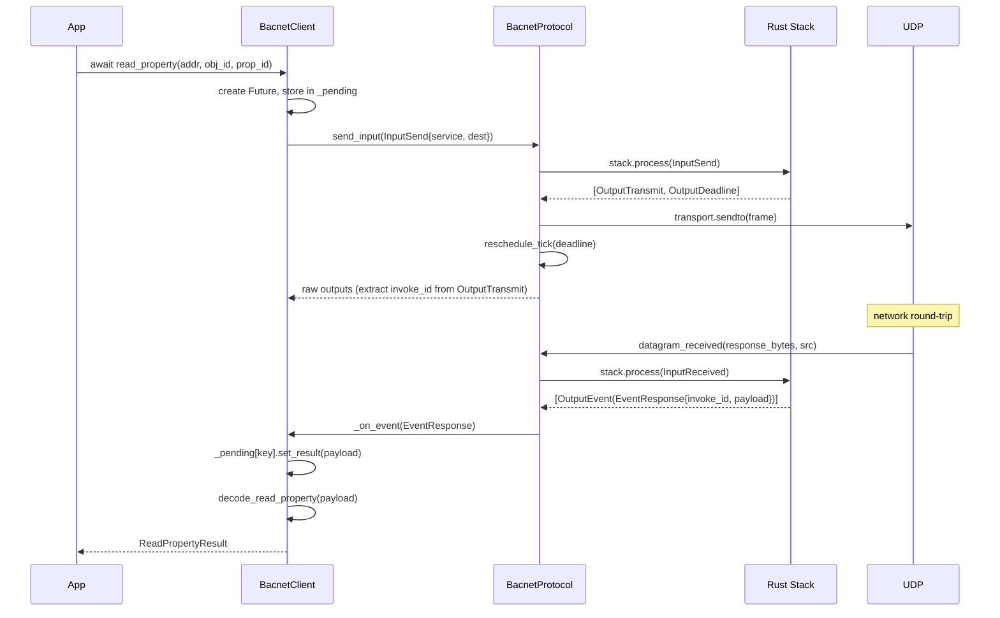
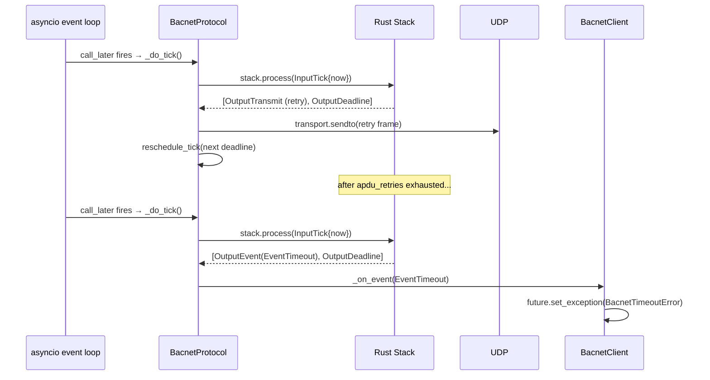
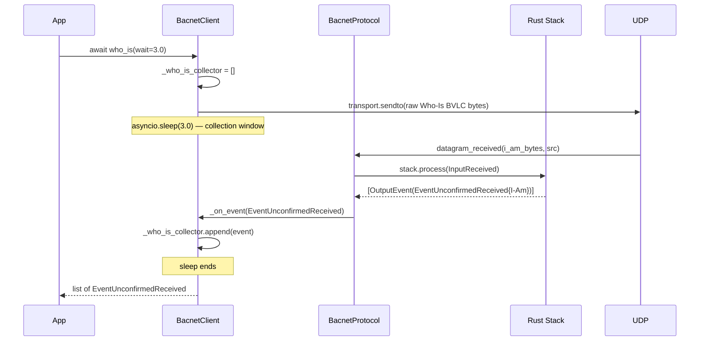

# Python asyncio Layer Internals

This document shows how `BacnetProtocol` and `BacnetClient` wire the Rust
`Stack` to real UDP I/O and the asyncio event loop.

## Component relationships



## Confirmed request sequence



## Timer-driven retry sequence



## Who-Is / unconfirmed flow

Who-Is bypasses the confirmed-request machinery entirely — it does not go
through the Rust `Stack` at all for sending. The Python layer builds the raw
BVLC/NPDU/APDU bytes directly and calls `transport.sendto`. Incoming I-Am
responses *do* go through the stack (via `datagram_received`) and arrive as
`EventUnconfirmedReceived` events.



## Invoke ID extraction

After calling `stack.process(InputSend(...))`, `BacnetClient` needs to know
which invoke ID was allocated so it can key the pending Future. Because the
`Stack` embeds the invoke ID inside the encoded APDU bytes rather than
returning it as a separate field, `_extract_invoke_id` parses it back out of
the first `OutputTransmit` frame:

```
BVLC header  (4 bytes, fixed)
NPDU         (2 bytes minimum; may be longer if routing headers present)
APDU byte 0  (PDU type + flags)
APDU byte 1  (max-segments | max-APDU)
APDU byte 2  ← invoke ID
```

The NPDU length is determined dynamically by checking the `DNET_PRESENT`
control bit (`0x20`) to detect routing overhead.
