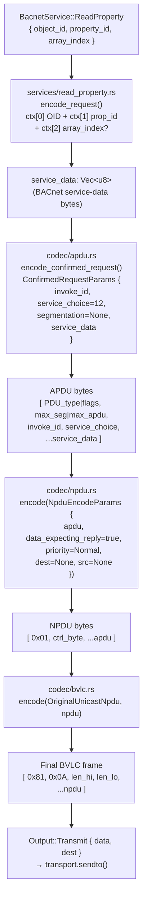
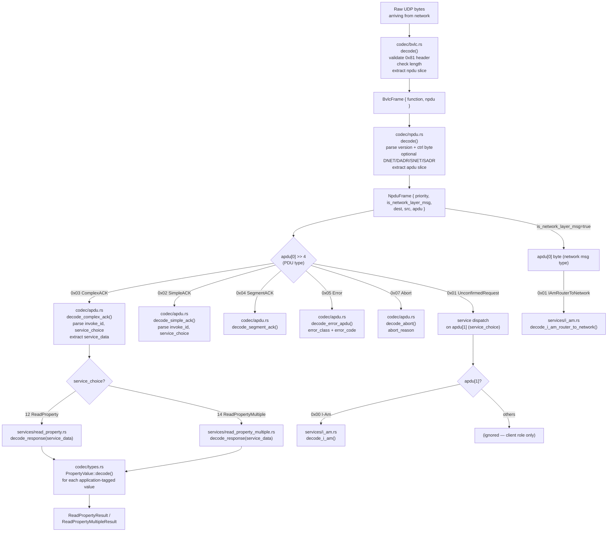
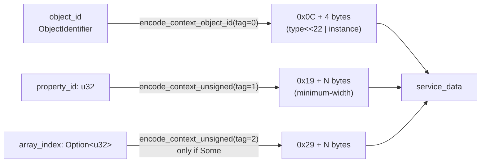
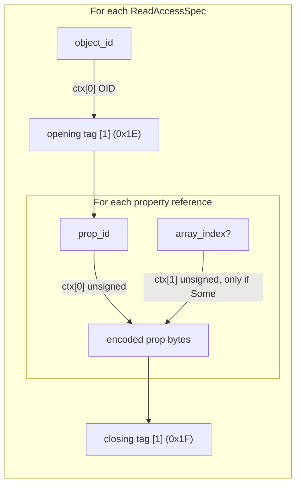
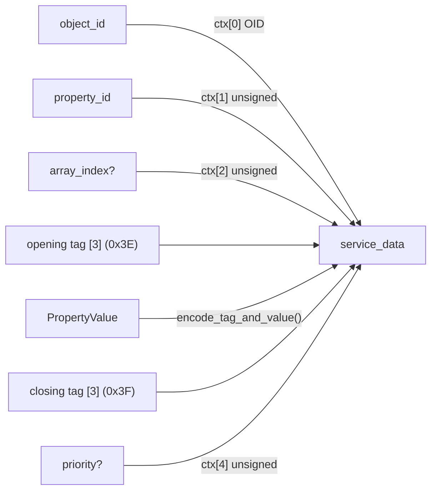
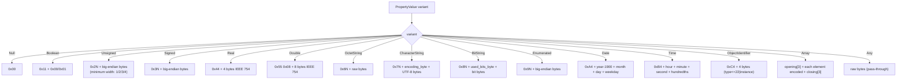

# Encoding Pipeline

This document shows how a high-level service request (e.g.
`ServiceReadProperty`) is transformed into wire bytes through the four
BACnet/IP protocol layers, and how the reverse decoding path works.

---

## Encode path — request



### Byte layout — unsegmented ReadProperty request

```
Offset  Len  Field
──────  ───  ─────────────────────────────────────────────────────────
 0       1   BVLC type       0x81
 1       1   BVLC function   0x0A  (OriginalUnicastNpdu)
 2       2   BVLC length     big-endian total frame length
 4       1   NPDU version    0x01
 5       1   NPDU control    0x04  (data-expecting-reply, normal priority)
 6       1   APDU byte 0     0x00  (ConfirmedRequest, no seg flags)
 7       1   APDU byte 1     max-segments | max-APDU-length  (0x05 = up to 1476 B)
 8       1   invoke_id
 9       1   service_choice  0x0C  (ReadProperty = 12)
10       5   ctx[0] OID      0x0C + 4-byte big-endian (object_type<<22 | instance)
15       2   ctx[1] prop_id  0x19 + 1-byte prop_id  (or longer for large IDs)
17       *   ctx[2] arr_idx  optional — only present if array_index is Some
```

---

## Decode path — response



---

## Service-data encoding in detail

### ReadProperty request (`service_choice = 12`)



### ReadPropertyMultiple request (`service_choice = 14`)



### WriteProperty request (`service_choice = 15`)



---

## PropertyValue encoding

`PropertyValue` uses BACnet **application tags** (upper nibble = tag number,
lower nibble = length or extended-length indicator). All values are encoded
and decoded in `codec/types.rs`.



Tag number `N` in the lower nibble encodes the byte length inline for values
of 1–4 bytes. Values of 5+ bytes use the extended-length form
(`0xN5 + length_byte + ...`).

---

## NPDU routing header (optional)

When a message is routed through a BACnet router, the NPDU carries optional
DNET/DADR (destination network/address) and SNET/SADR (source
network/address) fields. libbacnet generates plain unicast and broadcast
frames with no routing headers (`dest=None`, `src=None`).

```
ctrl byte bit layout:
  bit 7  NETWORK_LAYER_MSG  — set for network-layer messages (IAmRouter etc.)
  bit 5  DNET_PRESENT       — destination network address follows
  bit 3  SNET_PRESENT       — source network address follows
  bit 2  DATA_EXPECTING_REPLY — set for confirmed requests
  bit 1:0 PRIORITY          — 0=Normal, 1=Urgent, 2=CriticalEquipment, 3=LifeSafety
```
