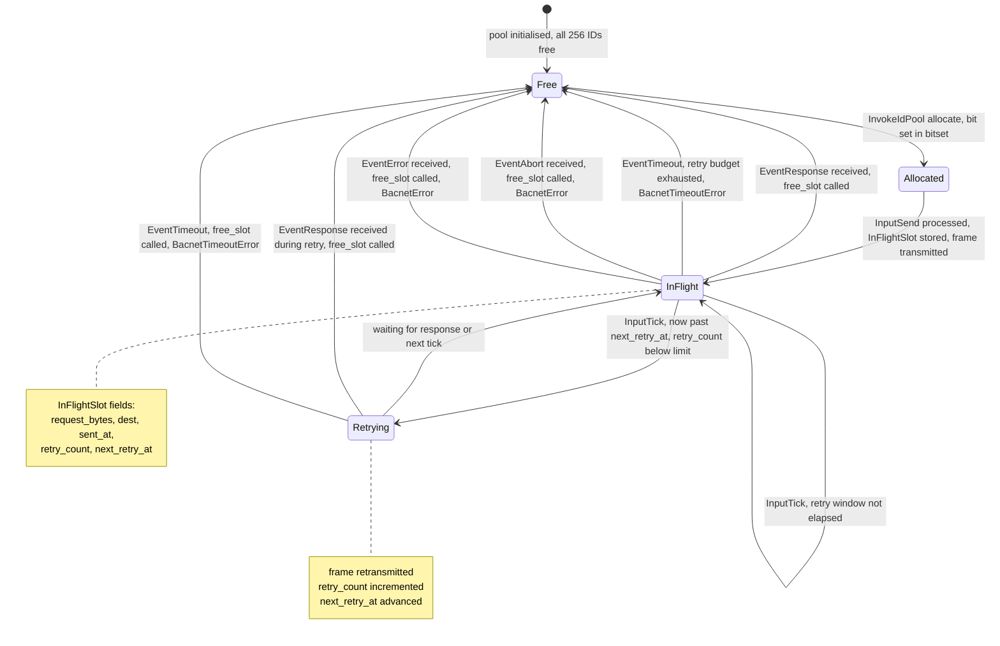
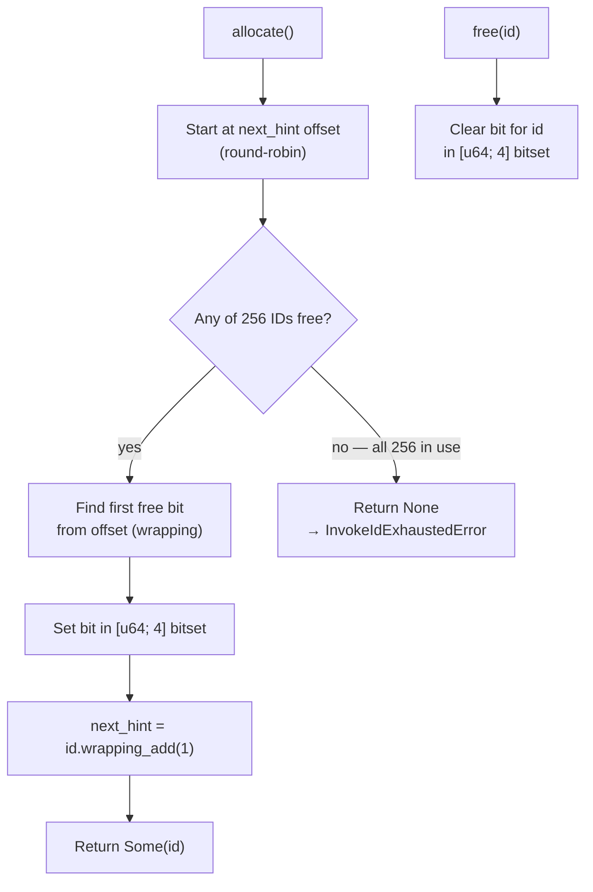

# Invoke ID Lifecycle

Every confirmed BACnet request (ReadProperty, ReadPropertyMultiple,
WriteProperty) is tracked by an **invoke ID** — a single byte (0–255) that
pairs a request with its response. This document covers how invoke IDs are
allocated, tracked, retried, and freed.

## Per-destination pools

Each destination address gets its own independent `InvokeIdPool`. A pool is
a 256-bit bitset (`[u64; 4]`) with a round-robin hint so successive
allocations spread across the ID space rather than always starting at 0.

Up to **256 requests can be in-flight simultaneously to a single
destination**. Attempting a 257th raises `InvokeIdExhaustedError`.

## State diagram — single invoke ID

## InvokeIdPool bit allocation

## Retry timing

```mermaid
gantt
    title Invoke ID timeline (apdu_timeout_secs=3, apdu_retries=3)
    dateFormat  s
    axisFormat %Ss

    section Request
    Initial transmit     : milestone, 0, 0
    Retry 1              : milestone, 3, 0
    Retry 2              : milestone, 6, 0
    Retry 3 (final)      : milestone, 9, 0
    Timeout event        : crit, milestone, 12, 0

    section In-flight window
    retry_count=0        : active, 0, 3s
    retry_count=1        : active, 3, 3s
    retry_count=2        : active, 6, 3s
    retry_count=3        : crit, 9, 3s
```

`next_retry_at` is set to `sent_at + apdu_timeout_secs` on first transmit and
advanced by `apdu_timeout_secs` on each retry. When `retry_count ≥ apdu_retries`
on the next tick, a `BacnetEvent::Timeout` is emitted and the slot is freed.

## Segmented requests and invoke IDs

Segmented outgoing requests consume an invoke ID in the same way, but the
`InFlightSlot` is a **placeholder** with `request_bytes = []` and
`next_retry_at = f64::INFINITY`. This prevents the unsegmented retry loop from
touching it — `SendSegState` manages its own window-level timeout independently.
The ID is freed only when `SendSegState::handle_seg_ack` signals completion, or
when the reassembly times out on the remote side and an Abort PDU is returned.

## Backpressure

Because `InvokeIdExhaustedError` is raised synchronously inside
`Stack::process(InputSend)`, the Python layer surfaces it immediately as an
exception on the `await client.read_property(...)` call. No request is queued
internally — callers must handle this error and retry at the application level.
