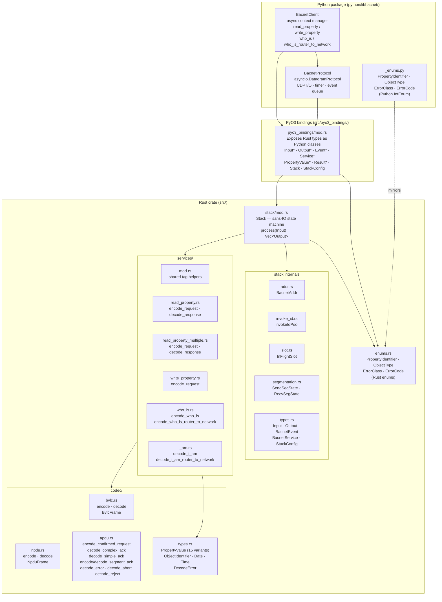

# Layer Architecture

This document maps the full module and layer hierarchy of `libbacnet`, from
raw wire bytes up to the Python `async def` API.

## Module map

## Layer responsibilities

| Layer | Location | Responsibility |
|---|---|---|
| **BacnetClient** | `python/libbacnet/_asyncio.py` | High-level `async def` API. Builds service objects, awaits futures, decodes results. |
| **BacnetProtocol** | `python/libbacnet/_asyncio.py` | Wires the Rust `Stack` to a real UDP socket and asyncio timer. Owns the event queue. |
| **PyO3 bindings** | `src/pyo3_bindings/mod.rs` | Exposes every Rust type as a Python class. Converts Python objects → Rust enums → Python objects on the way back. |
| **Stack** | `src/stack/` | Pure sans-IO state machine. No I/O. No clock. Drives all BACnet protocol logic: invoke IDs, retries, timeouts, segmentation. |
| **Services** | `src/services/` | Service-specific encode/decode: ReadProperty, ReadPropertyMultiple, WriteProperty, Who-Is, I-Am, IAmRouterToNetwork. |
| **Codec** | `src/codec/` | Wire-format encode/decode for the four BACnet/IP layers: BVLC, NPDU, APDU, and application-typed values. |
| **Enums** | `src/enums.rs` / `python/libbacnet/_enums.py` | Shared BACnet enumeration values (property IDs, object types, error codes). Python side mirrors Rust side as `IntEnum`. |

## Key design boundaries

- **The `Stack` never crosses the Rust/Python boundary directly.** All
  crossing happens in `pyo3_bindings`, which converts between Rust `Input`/
  `Output` enums and their Python counterparts.

- **`#[cfg(not(test))]` isolates PyO3.** During `cargo test`, the
  `pyo3_bindings` module is excluded entirely, so Rust unit tests compile
  without a Python interpreter.

- **The codec layer has no knowledge of the stack.** `codec/` only encodes
  and decodes bytes; it holds no state and makes no decisions. The stack
  calls into the codec directly; the Python layer never touches the codec.
