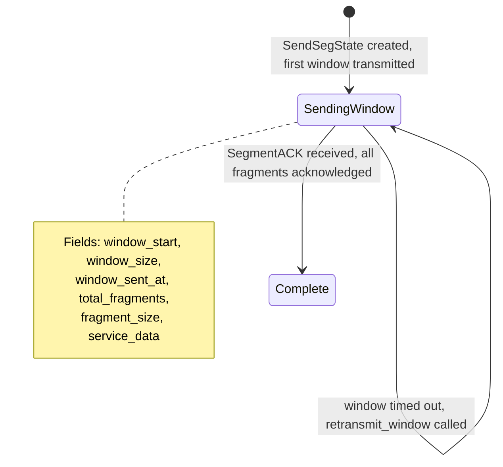
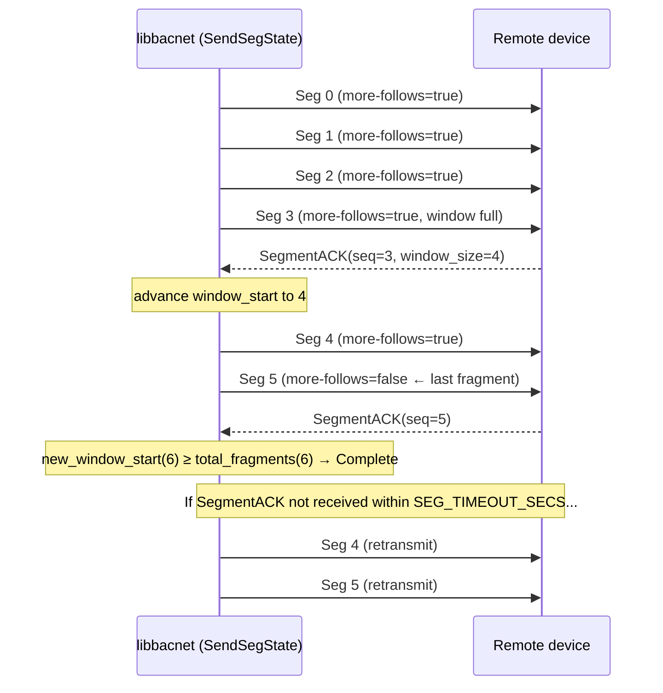
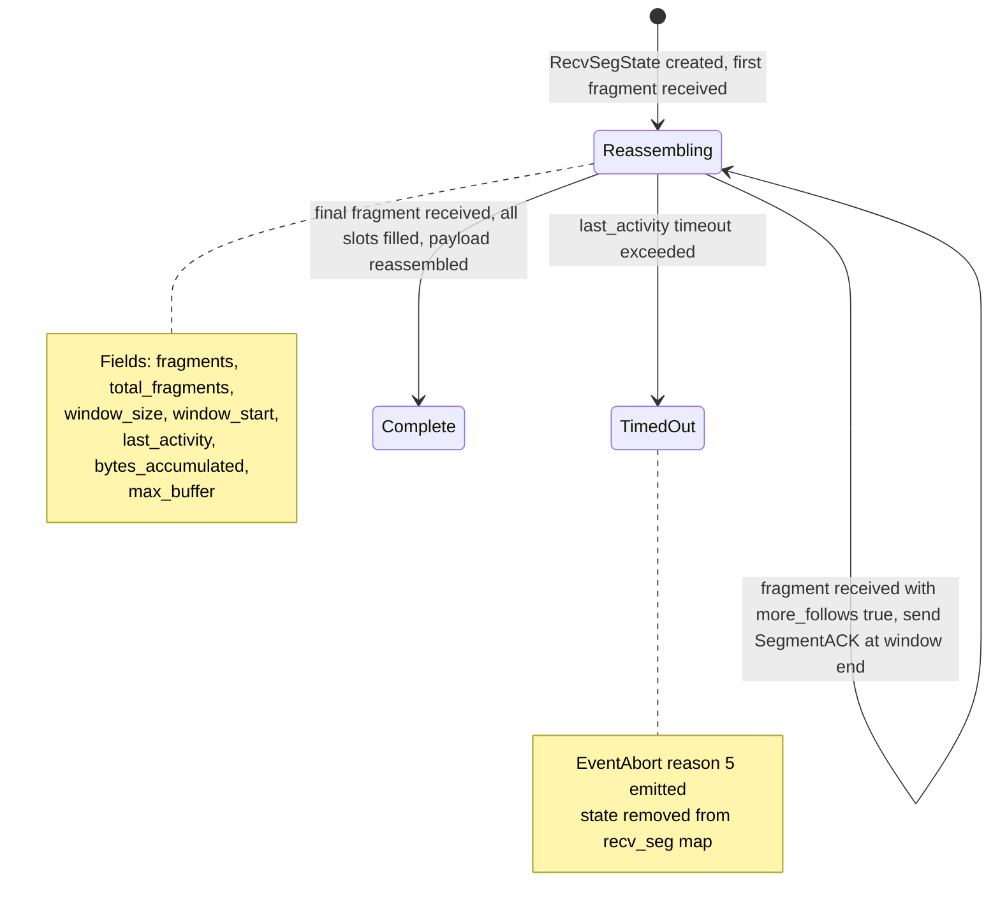
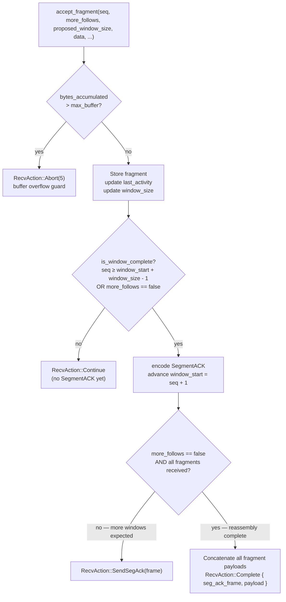
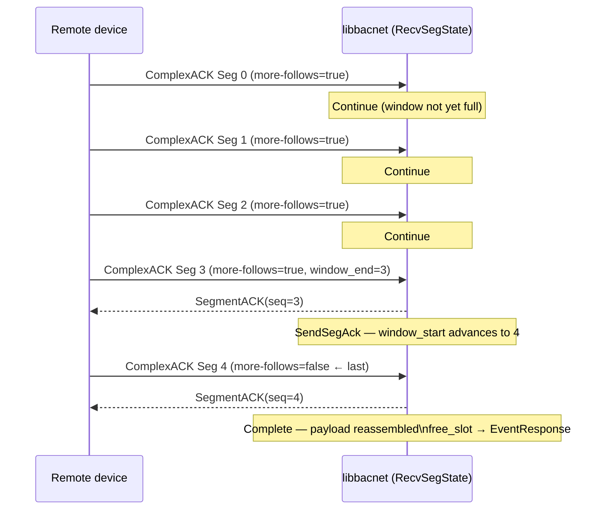

# Segmentation State Machines

BACnet segmentation splits large messages across multiple APDU frames when
they exceed `max_apdu_length`. libbacnet implements both sides:
`SendSegState` (outgoing large requests) and `RecvSegState` (incoming
segmented responses).

Constants used throughout:

| Constant | Value | Meaning |
|---|---|---|
| `DEFAULT_WINDOW_SIZE` | 4 | Segments sent per window before waiting for SegmentACK |
| `SEG_TIMEOUT_SECS` | 2.0 s | Window-level retransmit / reassembly timeout |
| `ABORT_REASON_REASSEMBLY_TIMEOUT` | 5 | BACnet abort reason byte for timeout |

---

## Send side — `SendSegState`

Used when an outgoing service payload exceeds `max_apdu_length`. The payload
is pre-sliced into fixed-size fragments; a *window* of frames is sent at once,
then the sender waits for a cumulative `SegmentACK` before advancing.

### Window flow

---

## Receive side — `RecvSegState`

Used when an incoming ComplexACK arrives with the `more-follows` flag set.
Fragments are accumulated in a sparse `Vec<Option<Vec<u8>>>` indexed by
sequence number; a `SegmentACK` is sent back after each window.

### `RecvAction` values

### Reassembly flow

---

## How the Stack drives both state machines

Both `SendSegState` and `RecvSegState` are stored in `HashMap`s keyed by
`(BacnetAddr, invoke_id)`. The `Stack` accesses them from:

- **`handle_received`** — routes `SegmentACK` PDUs to `SendSegState::handle_seg_ack`; routes segmented `ComplexACK` fragments to `RecvSegState::accept_fragment`.
- **`handle_tick`** — checks `SendSegState::is_window_timed_out` and calls `retransmit_window`; checks `RecvSegState::is_timed_out` and emits `EventAbort`.

The placeholder `InFlightSlot` (with `request_bytes = []` and
`next_retry_at = ∞`) guards the invoke ID for the lifetime of the send-side
segmentation, preventing the unsegmented retry loop from interfering.
