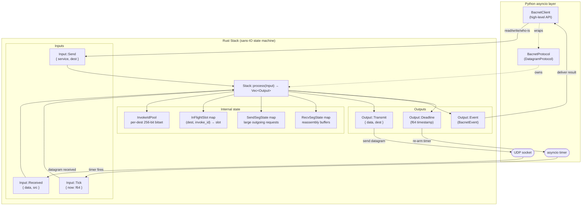
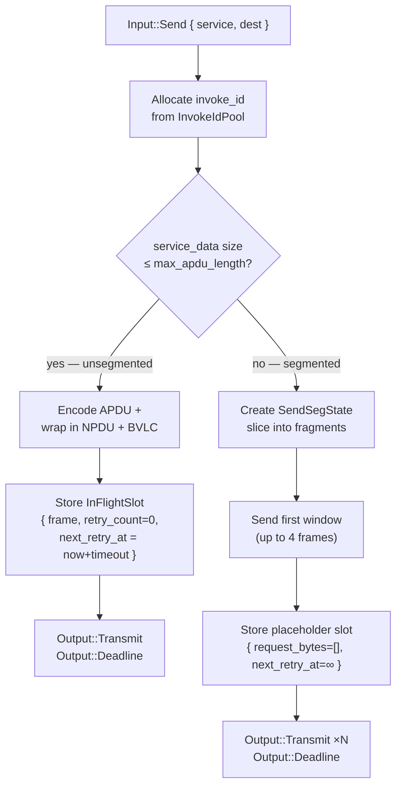
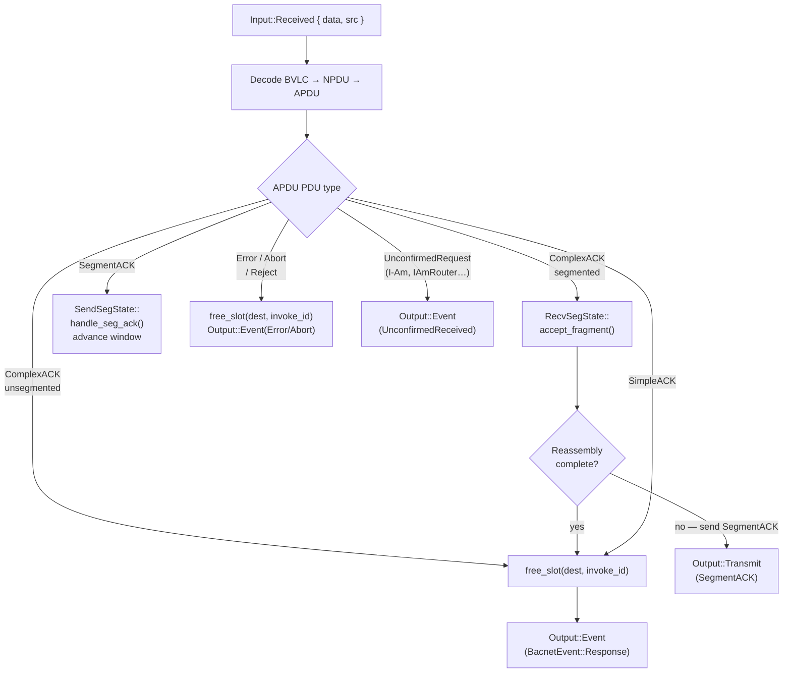
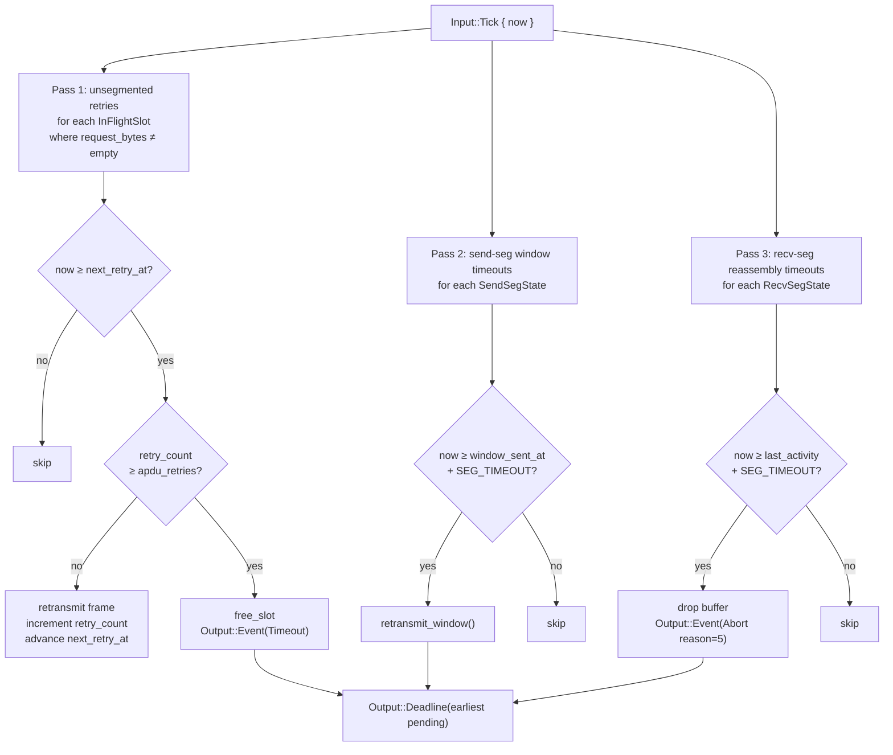

# Stack architecture

These diagrams represent the Rust Stack and its interactions with the Python asyncio layer.

### Input::Send — confirmed request path

### Input::Received — response dispatch

### Input::Tick — retry and timeout sweep

